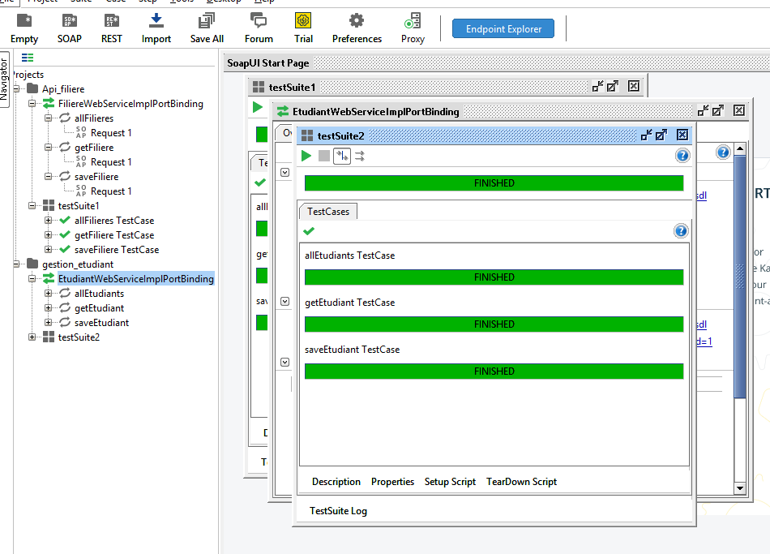
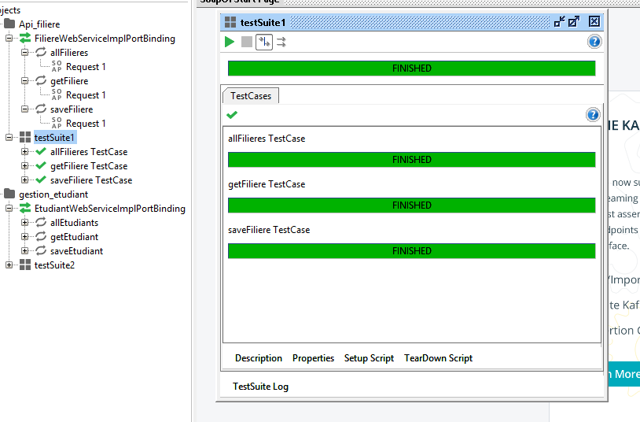

# Documentation du Projet SOAP : Gestion des Étudiants et des Filières

## Introduction

Ce projet implémente deux services web SOAP en Java EE pour la gestion des entités `Etudiant` et `Filiere`, avec déploiement dans un serveur Tomcat. L’objectif est d’exposer ces entités via des web services JAX-WS, permettant la consultation, la création, et la gestion des données.

## Technologies utilisées

- Java EE (Jakarta)
- JAX-WS (SOAP)
- Apache Tomcat 10
- MySQL 8 (Docker)
- phpMyAdmin (Docker)
- Eclipse / IntelliJ IDEA
- Postman / ReadyAPI pour les tests
- JAXB pour la sérialisation XML

## Architecture du projet

Le projet est structuré comme suit :

```
src/
├── com.groupeisi.metier.dto/
│   ├── EtudiantDto.java
│   └── FiliereDto.java
├── com.groupeisi.webservices.services/
│   ├── EtudiantWebService.java
│   ├── EtudiantWebServiceImpl.java
│   ├── FiliereWebService.java
│   └── FiliereWebServiceImpl.java
└── resources/
    ├── web.xml
    └── sun-jaxws.xml
```

## 1. Configuration des services

### `web.xml`

Le fichier `web.xml` configure les servlets SOAP pour chaque service :

```xml
<servlet>
    <servlet-name>FiliereWebService</servlet-name>
    <servlet-class>com.sun.xml.ws.transport.http.servlet.WSServlet</servlet-class>
    <load-on-startup>2</load-on-startup>
</servlet>
<servlet-mapping>
    <servlet-name>FiliereWebService</servlet-name>
    <url-pattern>/filiereWebService</url-pattern>
</servlet-mapping>
```

> Idem pour `EtudiantWebService`

### `sun-jaxws.xml`

Ce fichier liste les endpoints SOAP exposés :

```xml
<endpoints xmlns="http://java.sun.com/xml/ns/jax-ws/ri/runtime" version="2.0">
    <endpoint
        implementation="com.groupeisi.webservices.services.FiliereWebServiceImpl"
        name="FiliereWebService"
        url-pattern="/filiereWebService"/>
</endpoints>
```

## 2. DTOs

### `EtudiantDto.java`

```java
@XmlRootElement(name = "etudiant")
public class EtudiantDto {
    private int id;
    private String nom;
    private String prenom;
    private String email;
    private String dateNaissance;
    private int idFiliere;
}
```

### `FiliereDto.java`

```java
@XmlRootElement(name = "filiere")
public class FiliereDto {
    private int id;
    private String code;
    private String intitule;
}
```

## 3. Interface et Implémentation des Services

### `FiliereWebService.java`

```java
@WebService
public interface FiliereWebService {
    @WebMethod
    FiliereDto get(@WebParam(name = "id") int id);

    @WebMethod
    List<FiliereDto> all();

    @WebMethod
    FiliereDto save(@WebParam(name = "filiere") FiliereDto filiereDto);
}
```

> L'implémentation appelle les services métier pour effectuer les actions.

## 4. Problèmes rencontrés et solutions

-  **Erreur WSSERVLET11** : Souvent liée à une mauvaise déclaration dans `sun-jaxws.xml` ou une erreur dans les annotations des DTOs (`@XmlElement`, etc.).
-  Solution : bien nommer les `@WebParam`, et éviter des noms génériques comme `arg0`.
-  **Conflit de déploiement** quand les deux services sont activés.
-  Solution : vérifier les servlets dans `web.xml` et `sun-jaxws.xml`.

## 5. Tests

Les tests ont été réalisés via :

- **SOAP UI** pour les appels SOAP
- **phpMyAdmin** pour vérifier l'insertion des données dans MySQL
- **Docker** pour simuler l'environnement de production localement

```bash
docker exec -it container-mysql-m1gl mysql -u root -p
```

## 6. Résultat

Les services suivants sont exposés :

- `http://localhost:8080/webservices/filiereWebService?wsdl`
- `http://localhost:8080/webservices/etudiantWebService?wsdl`

Ils exposent les opérations ADD, SAVE  pour les entités `Filiere` et `Etudiant`.




---

## Auteur

Amy Diop  
Développeuse Java / Web Services  
Projet SOAP JAX-WS – 2025
